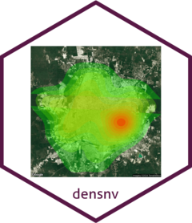

<!-- README.md is generated from README.Rmd. Please edit that file -->

# densnv

<!-- badges: start -->
<!-- badges: end -->



El objetivo central del paquete densnv es realizar el análisis
exploratorio de las bases de datos de las Enfermedades Transmitidas por
Vector (ETV) e Intoxicación por Veneno de Artrópodos (IVA) del Sistema
Nacional de Vigilancia Epidemiológica
([SINAVE](https://www.sinave.gob.mx)) de la Secretaría de Salud de
México a través de graficos, tablas y mapas con el objetivo de incidir
de manera directa en la toma de desiciones racionales y oportunas en los
programas de ETVS

El paquete esta dividido en cuatro grupo de funciones identificadas con
los prefijos rd, gr, mps, & tbl.

- **rd** es una contracción de la palabra read y carga las bases de
  datos en R.

- **gr** genera un gráfico.

- **mps** genera un mapa

- **tbl** genera una tabla.

## Instalación

La version en desarrollo del paquete densnv esta alojada en
[GitHub](https://github.com/) y se puede instalar en R con varios
paquetes: [devtools](https://devtools.r-lib.org),
[remotes](https://remotes.r-lib.org),
[renv](https://rstudio.github.io/renv/articles/renv.html) y
[pak](https://pak.r-lib.org)

``` r
# install.packages("pak")
pak::pkg_install("fdzul/densnv")
```

## Creditos

Las bases de datos de las Enfermedades Transmitidas por Vector (ETV) e
Intoxicación por Veneno de Artrópodos (IVA) del Sistema Nacional de
Vigilancia Epidemiológica ([SINAVE](https://www.sinave.gob.mx)) de la
Secretaría de Salud de México son bases para uso exlusivo del personal
de las Secretarías de Salud de los Estados y del nivel federal.

Original shapefiles are created by official government institutions
([INEGI](https://www.inegi.org.mx/temas/mg) &
[INE](https://pautas.ine.mx/transparencia/mapas/)).

## Licencia

Este proyecto tiene la licencia MIT - consulte el archivo
[LICENSE.md](LICENSE.md) para obtener más detalles.

## Inspiración

El paquete se inspiró en la necesidad de contribuir a la toma de
decisiones en el programa de prevención y control del dengue,
específicamente a través de la identificación de los escenarios
operativos de la transmisión activa.

## Ayuda.

Si encuentra un error en el codigo, presente un ejemplo mínimo
reproducible en [github](https://github.com/fdzul/rgeomex/issues). Para
preguntas y otras discusiones, no dudes en contactarme
(<felipe.dzul.m@gmail.com>)

------------------------------------------------------------------------

Tenga en cuenta que este proyecto se publica con un [Código de
Conducta](https://dplyr.tidyverse.org/CODE_OF_CONDUCT). Al participar en
este proyecto usted acepta cumplir con sus términos.
